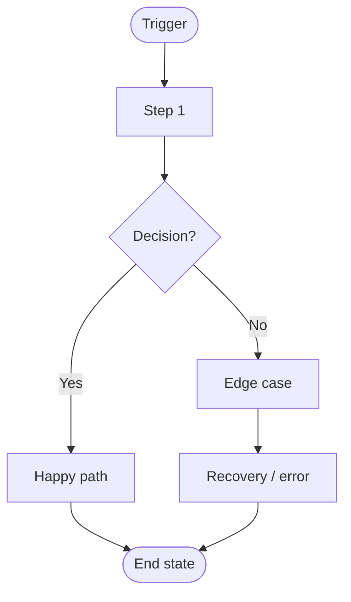

# Draft Reference

Translate a change request into a full SOT proposal: solution concept, architecture
changes (c3), UI/UX docs (flows, screens, components), and a visual review via prev-cli.
The approval-listener fires the merge + handoff pipeline automatically when approved.

## Flow

```
Request → Conflict Check → CR ID Assigned → Solution Concept → [User confirms]
       → Branch → ADR → c3x Architecture → UI/UX Docs → c3x check → Commit
       → GitHub PR (diff review) + prev-cli preview (rendered UI) + Tunnel (shareable)
       → Notify team with PR link + preview URL
```

## Progress Checklist

```
- [ ] Change request understood
- [ ] Conflict check passed (no file overlap with active CRs)
- [ ] CR ID assigned (cr-NNN)
- [ ] Solution concept drafted + confirmed
- [ ] Draft branch created
- [ ] ADR created (c3x add adr)
- [ ] c3 entities updated (add/wire/set)
- [ ] UI/UX docs written (flows, screens, components)
- [ ] c3x check passes
- [ ] Draft committed
- [ ] GitHub PR created (with preview URL in description)
- [ ] prev-cli instance spawned on allocated port
- [ ] Cloudflare tunnel active (shareable URL)
- [ ] approval-listener running (port 3999)
- [ ] Team notified: PR link + preview URL
```

---

## Step 0: Conflict Check + CR ID Assignment

Before anything else:

```bash
# Read active CRs
cat $SOT_REPO/active-crs.json 2>/dev/null || echo "{}"
```

1. **Assign CR ID**: next available `cr-NNN` (e.g., if cr-001 exists → cr-002)
2. **Conflict check**: extract files likely to be touched → check against `files_changed` of active CRs
   - If overlap found: warn user "CR-NNN is currently modifying overlapping files. Proceed with caution or wait for it to merge."
   - If no overlap: continue

---

## Step 1: Understand the Change Request

Extract from the user's message:
- **What** — what capability/feature is being added or changed?
- **Why** — the business reason (goes into ADR)
- **Scope** — which containers/components are affected? Any new ones needed?
- **UX surface** — does this have a user-facing UI? Mobile, web, or both?

If ambiguous, ask ONE clarifying question. Skip if ASSUMPTION_MODE.

---

## Step 2: Draft Solution Concept (pre-ADR)

Before touching any files, summarize the proposed solution and present it to the user:

```
💡 Proposed solution: **{SLUG}**

**Approach:** [2-3 sentences — the technical approach and why]

**Architecture impact:**
- New containers: [list or "none"]
- New components: [list]
- Modified components: [list]
- New cross-cutting refs: [list or "none"]

**UI/UX surface:**
- [Describe key screens/flows affected, or "no UI changes"]

**Trade-offs:**
- [Key trade-off or assumption]

Reply **"looks good"** to proceed, or tell me what to change.
```

Wait for confirmation. If ASSUMPTION_MODE, tag with [ASSUMED] and continue.

---

## Step 3: Create Draft Branch

```bash
cd $SOT_REPO
CR_ID="cr-$(printf '%03d' $CR_NUMBER)"   # e.g., cr-002
BRANCH="draft/${CR_ID}-$(echo $SLUG | tr ' ' '-' | tr '[:upper:]' '[:lower:]')"
git checkout -b $BRANCH
```

Register CR in `$SOT_REPO/active-crs.json`:
```json
{
  "cr-002": {
    "id": "cr-002",
    "slug": "$SLUG",
    "user": "$USER",
    "branch": "$BRANCH",
    "status": "drafting",
    "created_at": "NOW",
    "files_changed": []
  }
}
```

---

## Step 4: ADR First (Non-Negotiable)

```bash
bash $C3X add adr $SLUG --c3-dir $SOT_REPO/.c3
```

Fill ADR frontmatter:
```yaml
---
id: adr-YYYYMMDD-{slug}
title: [Change Title]
status: proposed
date: YYYY-MM-DD
affects: []
---
```

Fill ADR body:
- **Context:** Why this change is needed
- **Decision:** What we're doing (reference solution concept)
- **Impact:** Containers/components affected
- **Consequences:** Trade-offs, risks, open questions

---

## Step 5: c3x Architecture Changes

Run `c3x list --json` to understand current topology. Then make changes:

**New component:**
```bash
bash $C3X add component $SLUG --container c3-N --c3-dir $SOT_REPO/.c3
```

**Wire dependencies:**
```bash
bash $C3X wire c3-NNN cite ref-$PATTERN --c3-dir $SOT_REPO/.c3
```

**Update existing entity:**
```bash
bash $C3X set c3-NNN --section "Dependencies" --c3-dir $SOT_REPO/.c3
```

**Tag external API dependencies (chub IDs):**
When a component uses a third-party API/SDK, record the chub ID in its spec under `## External APIs`:
```markdown
## External APIs
- `github/octokit` — GitHub REST API (PR creation, branch management)
- `stripe/api` — Payment processing
```
These IDs propagate to the handoff payload as `chub_ids` so Coder Agents pre-fetch docs before writing code.

**New cross-cutting ref:**
```bash
bash $C3X add ref $SLUG --c3-dir $SOT_REPO/.c3
```

**Impact sweep** — flag blast radius in ADR:
```bash
bash $C3X list --json --c3-dir $SOT_REPO/.c3
```

---

## Step 6: UI/UX Docs

> Skip entirely if the change has no user-facing UI surface.

Write into `$SOT_REPO/docs/ui/`. These are **authoritative specs** — Coder Agents implement
screens exactly as written here. Do not leave placeholder text.

### 6a: User Flows (`docs/ui/flows/{slug}.mdx`)

```mdx
---
title: {Feature} Flow
description: End-to-end user journey for {feature}
---

# {Feature} Flow

## Trigger
[What initiates this flow — user action, system event, etc.]

## Flow Diagram



## Screen Sequence

| Step | Screen | Key Action | Next |
|---|---|---|---|
| 1 | [Screen name] | [What user does] | [Next screen] |

## Edge Cases

| Scenario | Behavior |
|---|---|
| [Error/empty state] | [Exact UI response] |
```

### 6b: Screen Specs (`docs/ui/screens/{slug}.mdx`)

One file per new or significantly changed screen:

```mdx
---
title: {Screen Name}
description: Spec for {screen name}
---

# {Screen Name}

```yaml
screen: {ScreenName}
route: /{path}
container: c3-N-{container}
component: c3-NNN-{component}
status: draft
platform: mobile | web | both
```

## Layout

```
[ASCII layout diagram showing key zones and elements]
```

## States

| State | Description | UI Behavior |
|---|---|---|
| Loading | ... | Skeleton screens |
| Empty | ... | Illustration + CTA |
| Populated | ... | Normal render |
| Error | ... | Error banner + retry |

## Interactions

| Element | Action | Result |
|---|---|---|
| [Element] | [Tap/Click] | [What happens] |

## Acceptance Criteria

- [ ] [Specific, testable requirement]
- [ ] [Performance requirement]
- [ ] [Accessibility requirement]
```

### 6c: Design System (`docs/ui/components/index.mdx`)

Update **only if** the change introduces new design tokens, new reusable components,
or new interaction patterns. Do not modify for feature-specific screens.

---

## Step 7: Validate

```bash
bash $C3X check --c3-dir $SOT_REPO/.c3
```

**If fails:** Fix schema errors before proceeding. Never visualize a broken SOT.
**If passes:** Continue.

---

## Step 8: Commit Draft

```bash
cd $SOT_REPO
git add -A
git commit -m "draft: $SLUG — architecture + UI/UX docs [pending approval]"
```

---

## Step 9: Create GitHub PR

```bash
# Get list of changed files for PR description
FILES=$(cd $SOT_REPO && git diff main...$BRANCH --name-only | tr '\n' ' ')

# Create PR via GitHub API
curl -s -X POST \
  -H "Authorization: token $GITHUB_TOKEN" \
  -H "Content-Type: application/json" \
  https://api.github.com/repos/$GITHUB_REPO/pulls \
  -d "{
    \"title\": \"[${CR_ID}] ${SLUG}\",
    \"head\": \"$BRANCH\",
    \"base\": \"main\",
    \"body\": \"## Change Request: ${CR_ID} — ${SLUG}\n\n**Requested by:** ${USER}\n**c3x check:** ✅ passed\n**Files changed:** ${FILES}\n\n### Preview\n> 🔗 Live preview (rendered UI flows + docs): **[Loading — will update shortly]**\n\n### Review checklist\n- [ ] Architecture changes make sense\n- [ ] UI flows are correct\n- [ ] ADR rationale is clear\n- [ ] No unintended scope creep\"
  }" | python3 -c "import json,sys; d=json.load(sys.stdin); print(d['number'], d['html_url'])"
```

Store `PR_NUMBER` + `PR_URL` in `active-crs.json` for this CR.

---

## Step 9b: Start prev-cli Instance (per-CR)

```bash
# Allocate port: base + number of active CRs
PREV_PORT=$(python3 -c "
import json, os
f = '$SOT_REPO/active-crs.json'
crs = json.load(open(f)) if os.path.exists(f) else {}
ports = [v.get('prev_port',0) for v in crs.values()]
p = 3001
while p in ports: p += 1
print(p)
")

# Use git worktree so main checkout stays clean
WORKTREE_DIR="/tmp/sot-preview-$CR_ID"
git -C $SOT_REPO worktree add "$WORKTREE_DIR" "$BRANCH" 2>/dev/null || \
  git -C "$WORKTREE_DIR" pull origin "$BRANCH" 2>/dev/null || true

# Start prev-cli on allocated port
$PREV dev -p $PREV_PORT -c "$WORKTREE_DIR" &
PREV_PID=$!

# Start Cloudflare tunnel for shareable URL
cloudflared tunnel --url "http://localhost:$PREV_PORT" \
  --hostname "${CR_ID}.${TUNNEL_DOMAIN}" &
TUNNEL_PID=$!
TUNNEL_URL="https://${CR_ID}.${TUNNEL_DOMAIN}"

# Update active-crs.json
python3 -c "
import json, os
f = '$SOT_REPO/active-crs.json'
crs = json.load(open(f)) if os.path.exists(f) else {}
crs['$CR_ID'].update({
  'prev_port': $PREV_PORT, 'prev_pid': $PREV_PID,
  'tunnel_url': '$TUNNEL_URL', 'tunnel_pid': $TUNNEL_PID,
  'pr_number': $PR_NUMBER, 'pr_url': '$PR_URL',
  'status': 'pending_review'
})
open(f,'w').write(json.dumps(crs, indent=2))
"

# Ensure shared approval-listener is running (port 3999) — handles ALL CRs
if ! curl -sf http://localhost:3999/health > /dev/null 2>&1; then
  SOT_REPO=$SOT_REPO C3X=$C3X PREV=$PREV \
    bash ~/.openclaw/workspace/skills/sot-manager/bin/start-listener.sh \
    --sot-repo $SOT_REPO --port 3999 --derived-repo $DERIVED_REPO &
fi
```

---

## Step 9c: Update PR Description with Preview URL

```bash
# Patch the PR body with actual tunnel URL
PR_BODY="## Change Request: ${CR_ID} — ${SLUG}

**Requested by:** ${USER}
**c3x check:** ✅ passed
**Files changed:** ${FILES}

### 🔗 Preview (rendered UI flows + docs)
**${TUNNEL_URL}**
_(Live preview on branch \`${BRANCH}\` — updates on push)_

### Review checklist
- [ ] Architecture changes make sense
- [ ] UI flows are correct
- [ ] ADR rationale is clear
- [ ] No unintended scope creep

---
_Approve by merging this PR. Handoff to Derived repo triggers automatically._"

curl -s -X PATCH \
  -H "Authorization: token $GITHUB_TOKEN" \
  https://api.github.com/repos/$GITHUB_REPO/pulls/$PR_NUMBER \
  -d "{\"body\": $(echo "$PR_BODY" | python3 -c 'import json,sys; print(json.dumps(sys.stdin.read()))')}"
```

---

## Step 10: Notify Team

```
📐 **[${CR_ID}] ${SLUG}** — ready for review

**Solution:** [1-sentence summary]

**Changes:**
- [c3 entities: e.g., "+ c3-104-offline-cache"]
- [UI: e.g., "SyncStatusScreen (new), offline-sync-flow (4 steps)"]
- ADR: adr-YYYYMMDD-${slug}

**Review:**
- 📄 PR (diff): ${PR_URL}
- 🎨 Preview (rendered UI/flows): ${TUNNEL_URL}

Merge the PR when approved — handoff triggers automatically.
```

---

## Revision Flow

If user requests changes after review:
1. Stay on same draft branch
2. Update based on feedback — re-run any affected steps (concept, ADR, c3 entities, UI docs)
3. Run `c3x check`
4. Commit: `git commit -m "draft: revise $SLUG — [what changed]"`
5. prev-cli hot-reloads automatically
6. Notify: "Updated proposal ready — same URL"
