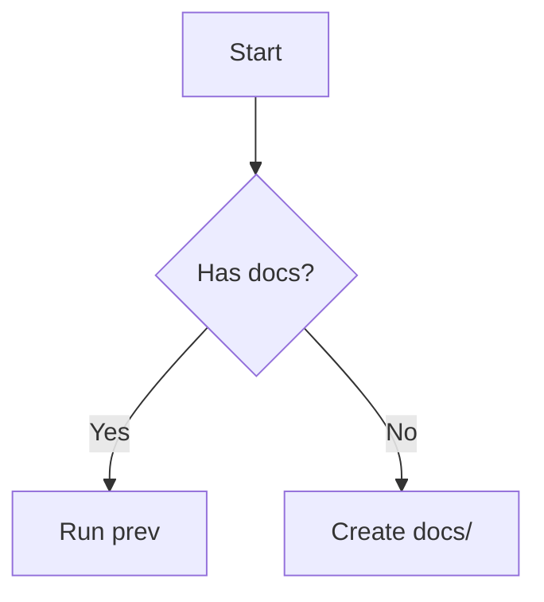

# Goal

Help the user build, configure, run, and deploy documentation sites using prev-cli
(v0.25.1) — the zero-config, Bun-powered docs generator. Get them from zero to a
running site as fast as possible, and answer any follow-up questions about features.

---

# Key Facts

- **Runtime:** Requires Bun (`curl -fsSL https://bun.sh/install | bash`)
- **Install:** `bun install -g prev-cli` or `npm install -g prev-cli`
- **GitHub:** https://github.com/lagz0ne/prev-cli
- **Content root:** `docs/` directory (auto-detected, no config)
- **D2 diagrams:** Work in `prev build` only — not in dev server (browser compat issue)

---

# Instructions

## 1. Classify intent

| User says | Action |
|---|---|
| "set up", "install", "start" | Walk through install + quick start |
| "build", "deploy", "github pages" | Cover `prev build` + deployment |
| "MDX", "React in docs", "@prev/ui" | Show MDX usage + component examples |
| "diagram", "mermaid" | Show Mermaid code block syntax |
| "live preview", "interactive" | Explain `prev create` + `<Preview>` embed |
| "config", "theme", "dark mode" | Explain `.prev.yaml` options |
| "sidebar order", "hide page" | Explain frontmatter `hidden` + `order` config |

## 2. Core commands

```bash
# Dev server (hot reload)
prev                  # random port
prev -p 3000          # fixed port
prev -c ./docs        # custom content dir

# Build & deploy
prev build            # → dist/
prev build -b /repo/  # with base path (GitHub Pages)
prev preview          # preview dist/ locally

# Scaffolding
prev create <name>    # scaffold previews/<name>/App.tsx
prev config init      # create .prev.yaml with defaults

# Maintenance
prev clearcache       # clear build cache
prev clean -d 7       # remove caches older than 7 days
prev validate         # validate preview configs
prev typecheck        # type-check preview TSX files
```

## 3. File → route mapping

```
docs/
├── index.md              → /
├── guide.md              → /guide
└── api/
    ├── users.md          → /api/users
    └── index.md          → /api
```

- `index.md` and `README.md` both map to directory root (`/`)
- Folders become sidebar sections automatically

## 4. Frontmatter

```yaml
---
title: My Page          # overrides H1
description: Summary
hidden: true            # hides from sidebar (still accessible by URL)
---
```

## 5. MDX + @prev/ui

```mdx
import { Button, Card, CardHeader, CardTitle, CardContent } from '@prev/ui'

<Card>
  <CardHeader><CardTitle>Hello</CardTitle></CardHeader>
  <CardContent>
    <p>Markdown + React.</p>
    <Button>Click me</Button>
  </CardContent>
</Card>
```

Available components: `Button`, `Card`, `CardHeader`, `CardTitle`, `CardContent`

## 6. Live Previews

```bash
prev create counter    # → previews/counter/App.tsx
```

```mdx
import { Preview } from '@prev/theme'
<Preview src="counter" />
```

`App.tsx` must have a default export React component.

## 7. Mermaid diagrams

````md

````

Works in both dev and production.

## 8. Configuration (.prev.yaml)

```yaml
theme: system          # light | dark | system
contentWidth: constrained  # constrained | full
port: 3000
hidden:
  - "drafts/**"
order:
  "/":
    - getting-started.md
    - guides/
```

## 9. Deployment

```bash
# GitHub Pages
prev build -b /repo-name/
# → push dist/ to gh-pages branch

# Netlify / Vercel
# Build command: prev build
# Output directory: dist
```

---

# Examples

## Example 1: New user, zero to running site

**User:** "How do I set up a docs site with prev-cli?"

**Response flow:**
1. Install Bun + prev-cli
2. `mkdir docs && echo "# Hello" > docs/index.md`
3. `prev` → open http://localhost:3000
4. Mention hot reload, sidebar auto-generated, dark mode built-in

## Example 2: MDX component in docs

**User:** "How do I add a button to my docs page?"

```mdx
import { Button } from '@prev/ui'

Click this: <Button>Try it</Button>
```

Rename the file to `.mdx`.

## Example 3: Deploy to GitHub Pages

**User:** "How do I deploy my prev docs to GitHub Pages?"

```bash
prev build -b /my-repo/
```

Then push `dist/` to the `gh-pages` branch, or use the GitHub Actions workflow:

```yaml
- run: bun install -g prev-cli
- run: prev build -b /my-repo/
- uses: peaceiris/actions-gh-pages@v3
  with:
    github_token: ${{ secrets.GITHUB_TOKEN }}
    publish_dir: ./dist
```

## Example 4: Live interactive preview

**User:** "Can I embed an interactive demo in my docs?"

```bash
prev create button-demo
# Edit previews/button-demo/App.tsx
```

```mdx
import { Preview } from '@prev/theme'
<Preview src="button-demo" />
```

---

# Constraints

- Bun is **required at runtime** — Node.js can install the package but `prev` will fail without Bun
- **D2 diagrams fail in dev server** — use `prev build` to test D2, or use Mermaid for dev-time previews
- Live previews require a default export in `App.tsx`
- `preview` command requires `prev build` to have been run first
- Content directory must be named `docs/`, `documentation/`, `content/`, or `pages/` for auto-detection — otherwise use `-c <path>`

<!-- Generated by Skill Creator Ultra v1.0 evaluation pass -->
